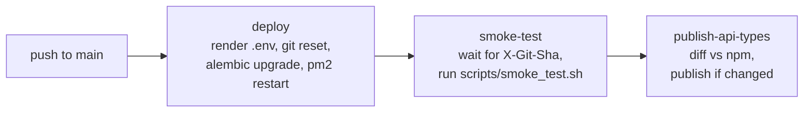

# Dog API

[](https://github.com/g-marcin/dog-api/actions/workflows/deploy.yml)
[](https://www.npmjs.com/package/@mgrzmil-org/api-types)

API for accessing dog breed images and information. Live at [api.mgrzmil.dev](https://api.mgrzmil.dev/docs).

## Highlights

- **FastAPI + PostgreSQL** with SQLAlchemy, Alembic migrations and PgBouncer-aware connection pooling
- **Gated deploy pipeline**: deploy → post-deploy smoke tests → npm publish; each stage runs only if the previous one passed
- **Verified rollouts**: `/healthcheck` returns the deployed commit (`X-Git-Sha`); smoke tests wait until prod serves the pushed commit before testing
- **Reusable smoke tests** extracted into a versioned GitHub Action, [g-marcin/smoke-test-action](https://github.com/g-marcin/smoke-test-action), shared across services
- **Typed client package**: OpenAPI spec → TypeScript types published as [`@mgrzmil-org/api-types`](https://www.npmjs.com/package/@mgrzmil-org/api-types) via npm trusted publishing (OIDC, no tokens) with provenance; skipped when types are unchanged
- **Config as code**: prod env vars and secrets live in a GitHub `production` environment and are rendered onto the VPS on each deploy
- **Observability**: OpenTelemetry tracing (FastAPI + SQLAlchemy), Prometheus `/metrics`, and a telemetry relay for the frontend

## CI/CD

Every push to `main` runs [`deploy.yml`](.github/workflows/deploy.yml):



Run the smoke tests locally against any instance:

```bash
scripts/smoke_test.sh                        # prod
scripts/smoke_test.sh http://localhost:8000  # local
```

## Project Structure

```
dog-api/
├── app/                          # Application code
│   ├── __init__.py
│   ├── main.py                  # FastAPI app instance
│   ├── models.py                # Domain models (Status, APIResponse)
│   ├── app_config.py            # FastAPI configuration
│   ├── openapi.py               # OpenAPI documentation setup
│   ├── middleware/              # Middleware
│   │   ├── __init__.py
│   │   └── cors.py              # CORS middleware
│   ├── routes/                  # API routes
│   │   ├── __init__.py
│   │   ├── breeds.py            # Breed endpoints
│   │   ├── descriptions.py      # Description endpoints
│   │   ├── health.py            # Health check endpoints
│   │   └── images.py            # Image endpoints
│   └── services/                # Business logic
│       ├── __init__.py
│       ├── breed_service.py     # Breed/image operations
│       └── description_service.py # Description operations
├── config.py                    # Environment configuration
├── main.py                      # Entry point (runs uvicorn)
├── server.py                    # Legacy file (deprecated)
├── env.example                  # Environment variables template
├── nginx.conf                   # Nginx configuration
└── reload-nginx.sh              # Nginx reload script
```

## Structure Overview

- **Root level**: Configuration files, entry point, deployment files
- **`app/`**: All application code (similar to `src/` in JavaScript projects)
  - **`models.py`**: Pydantic models and response utilities
  - **`routes/`**: API endpoint handlers
  - **`services/`**: Business logic layer
  - **`middleware/`**: HTTP middleware (CORS, etc.)
  - **`openapi.py`**: OpenAPI/Swagger documentation configuration
  - **`app_config.py`**: FastAPI application configuration
  - **`main.py`**: FastAPI app instance creation

## Running the Application

### Using Makefile

```bash
make dev          # Run development server
make start        # Run with auto-reload
make install      # Install dependencies
make test         # Run tests
make lint         # Lint code
make format       # Format code
make clean        # Clean cache files
```

### Using Python directly

```bash
python main.py                    # Run development server
uvicorn app.main:app --reload    # Run with auto-reload
```

The application will start on `http://localhost:8000` (or the port specified in `config.py`).

